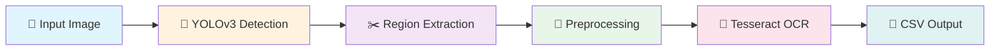

<div align="center">

# 🔍 Custom OCR System with YOLO & Tesseract

### *Intelligent Lab Report Text Extraction*

[](https://www.python.org/downloads/)
[](https://pjreddie.com/darknet/yolo/)
[](https://github.com/tesseract-ocr/tesseract)
[](https://colab.research.google.com/)
[](LICENSE)

*Transform lab reports into editable data with AI-powered precision*

[Features](#-features) • [Quick Start](#-quick-start) • [Workflow](#-workflow) • [Documentation](#-documentation)

---

</div>

## 🎯 Overview

<table>
<tr>
<td width="50%">

### **What is this?**
A sophisticated two-stage OCR pipeline that combines:
- 🎯 **YOLOv3** for intelligent text region detection
- 📝 **Tesseract** for accurate character recognition
- ☁️ **Cloud Integration** via Google Colab & Drive

</td>
<td width="50%">

### **Why use it?**
- ⚡ **Fast** processing of lab reports
- 🎓 **Custom trained** on your dataset
- 💰 **Cost-effective** (starts at $0)
- 📊 **Structured output** in CSV format

</td>
</tr>
</table>

---

## ✨ Features

<div align="center">

| 🤖 AI-Powered | 🎨 Preprocessing | 📦 Output | ⚙️ Deployment |
|:---:|:---:|:---:|:---:|
| Custom YOLOv3 | Image Enhancement | CSV Export | Google Colab |
| Object Detection | Grayscale + Blur | Batch Processing | Drive Integration |
| Region Extraction | Thresholding | Confidence Scores | GPU Acceleration |

</div>

---

## 🚀 Quick Start

### **Installation**

```bash
# 1. Install Tesseract OCR Engine
sudo apt-get install tesseract-ocr

# 2. Install Python Dependencies
pip install pytesseract opencv-python numpy
```

### **Run Inference**

```bash
python Custom_OCR.py --image your_lab_report.jpg
```

### **Google Colab Setup**

```python
# Mount Drive
from google.colab import drive
drive.mount('/content/drive')

# Create Structure
!mkdir -p /content/drive/MyDrive/OCR_Project/{datasets,models,results}

# Install Dependencies
!apt-get install tesseract-ocr
!pip install pytesseract opencv-python
```

---

## 📁 Project Structure

```
📦 OCR-Project
├── 📂 datasets/          # Training & test images
├── 📂 models/            # YOLOv3 trained weights
├── 📂 results/           # Output CSV & processed images
├── 📄 Custom_OCR.py      # Main inference script
├── 📄 train.py           # Training script
├── 📄 requirements.txt   # Dependencies
└── 📄 README.md          # Documentation
```
---

## 🔄 Workflow

<div align="center">



</div>

### **Pipeline Stages**

| Stage | Process | Output |
|-------|---------|--------|
| **1️⃣ Detection** | YOLOv3 identifies text regions | Bounding box coordinates |
| **2️⃣ Extraction** | Crop detected regions | Region images |
| **3️⃣ Preprocessing** | Resize, grayscale, blur, threshold | Enhanced images |
| **4️⃣ Recognition** | Tesseract extracts text | Raw text data |
| **5️⃣ Export** | Structure and save | CSV file |

---

## 🛠️ Development Roadmap

<table>
<tr>
<td width="25%" align="center">

### **Phase 1**
🔧 **Setup**
- Environment configuration
- Dependency installation
- Folder structure

</td>
<td width="25%" align="center">

### **Phase 2**
📊 **Data Prep**
- Dataset upload
- Image preprocessing
- Annotation creation

</td>
<td width="25%" align="center">

### **Phase 3**
🤖 **Training**
- YOLOv3 training
- Model validation
- Weight optimization

</td>
<td width="25%" align="center">

### **Phase 4**
🚀 **Deployment**
- Inference pipeline
- Output generation
- Performance tuning

</td>
</tr>
</table>

---

## 🎨 Image Processing Pipeline

<div align="center">

| Step | Action | Purpose |
|:----:|:------:|:-------:|
| 1️⃣ | **Resize (3x)** | Enhance small text regions |
| 2️⃣ | **Grayscale** | Simplify processing |
| 3️⃣ | **Gaussian Blur** | Reduce noise |
| 4️⃣ | **Otsu Threshold** | Separate text from background |
| 5️⃣ | **Bitwise NOT** | Invert for Tesseract (black on white) |

</div>

---

## 💰 Cost Structure

<div align="center">

| Service | Free Tier | Pro Tier | Pro+ Tier |
|---------|-----------|----------|-----------|
| **Google Colab** | ✅ Basic GPU | 💎 $10/month | 💎💎 $50/month |
| **Google Drive** | ✅ 15 GB | 💰 Pay as you go | 💰 Pay as you go |
| **Estimated Total** | **$0** | **~$10/month** | **~$50/month** |

### 💡 **Optimization Tips**
- Use free Colab for small datasets
- Compress images before upload
- Clean up unused files regularly

</div>

---

## 🔧 Prerequisites

### **System Requirements**

```yaml
Python: 3.7+
GPU: CUDA-compatible (recommended)
RAM: 8GB minimum
Storage: 10GB for models and data
```

### **Dependencies**

```txt
opencv-python
pytesseract
numpy
pillow>
```

---

## 📚 Detailed Documentation

<details>
<summary><b>🎯 YOLOv3 Training</b></summary>

### Training Configuration
- **Batch Size:** 16
- **Learning Rate:** 0.001
- **Epochs:** 100
- **Image Size:** 416x416
- **GPU:** Colab T4/P100

### Training Command
```bash
python train.py --data custom.data --cfg yolov3.cfg --weights darknet53.conv.74
```

</details>

<details>
<summary><b>🎨 Preprocessing Details</b></summary>

### Image Enhancement
```python
# Resize for better OCR
resized = cv2.resize(image, (0,0), fx=3, fy=3)

# Convert to grayscale
gray = cv2.cvtColor(resized, cv2.COLOR_BGR2GRAY)

# Apply Gaussian blur
blurred = cv2.GaussianBlur(gray, (5,5), 0)

# Otsu thresholding
_, thresh = cv2.threshold(blurred, 0, 255, cv2.THRESH_BINARY + cv2.THRESH_OTSU)

# Invert for Tesseract
final = cv2.bitwise_not(thresh)
```

</details>

<details>
<summary><b>📊 Output Format</b></summary>

### CSV Structure
```csv
Region_ID, Text, Confidence, X, Y, Width, Height
1, "Hemoglobin: 14.5", 95.2, 120, 45, 200, 30
2, "WBC Count: 8500", 92.8, 120, 85, 200, 30
```

</details>

---

## 🐛 Troubleshooting

<table>
<tr>
<td width="50%">

### ❌ **Common Issues**

**Tesseract Not Found**
```bash
sudo apt-get update
sudo apt-get install tesseract-ocr
```

**GPU Not Available**
- Runtime → Change runtime type → GPU

**Drive Mount Failed**
- Reconnect Google Drive
- Check folder permissions

</td>
<td width="50%">

### ✅ **Solutions**

**Low Accuracy**
- Increase training epochs
- Add more training data
- Adjust preprocessing parameters

**Slow Processing**
- Enable GPU acceleration
- Reduce image resolution
- Batch process images

**Memory Errors**
- Reduce batch size
- Clear runtime cache
- Upgrade to Colab Pro

</td>
</tr>
</table>

---
## 🤝 Contributing

We welcome contributions! Here's how you can help:

1. 🍴 Fork the repository
2. 🌟 Create a feature branch
3. ✨ Make your changes
4. 📝 Submit a pull request

---

## 📜 License

This project is part of an academic assignment.

---

## 👥 Contributors

<div align="center">

| Role | Name | Contact |
|------|------|---------|
| 👨‍💻 Developer | Ashish Pachauri
</div>

---

### ⭐ Star this repository if you find it helpful!

**Academic Excellence**

*Transforming Lab Reports into Structured Data, One Image at a Time*

---

© 2025 Custom OCR Project. All Rights Reserved.

</div>
